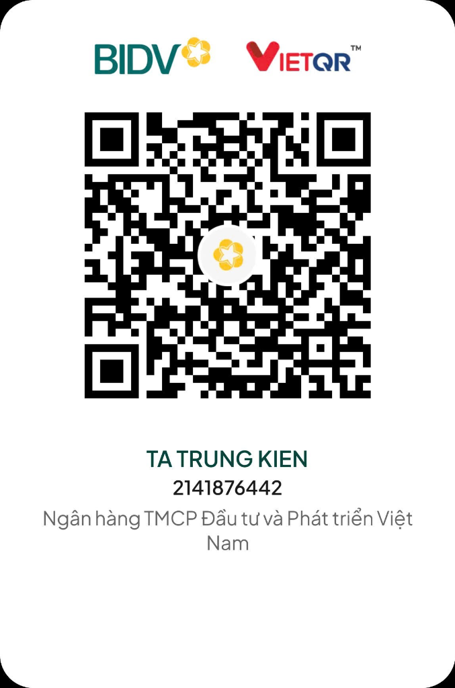

# 📘 TÀI LIỆU GIỚI THIỆU TỔNG QUAN & TÍNH NĂNG CHI TIẾT
# SIMPLY IT — COMMUNITY EDITION (CE)
### *Hệ Thống Quản Trị Dịch Vụ & Vòng Đời Tài Sản CNTT Doanh Nghiệp Toàn Diện*

---

## 🌟 1. GIỚI THIỆU TỔNG QUAN

**SIMPLY IT (Community Edition)** là giải pháp phần mềm quản trị hạ tầng và dịch vụ CNTT toàn diện (ITSM & ITAM) được nghiên cứu và phát triển nhằm giải quyết triệt để bài toán thất thoát tài sản, quá tải sự cố hỗ trợ kỹ thuật và thiếu tính minh bạch trong vận hành IT tại các cơ quan, tổ chức và doanh nghiệp.

Với triết lý **"Do Less – Achieve More" (Làm ít hơn – Đạt hiệu quả cao hơn)**, SIMPLY IT tinh gọn tối đa các quy trình phức tạp, mang lại một giao diện trực quan, khoa học, giúp đội ngũ IT quản lý hàng nghìn thiết bị và yêu cầu hỗ trợ chỉ trên **một nền tảng duy nhất**.

> 💡 **Đặc quyền phiên bản Community Edition (CE)**:
> * **Hoàn toàn Miễn Phí Vĩnh Viễn** (Phát hành theo giấy phép mã nguồn mở Apache 2.0).
> * **Không giới hạn** số lượng thiết bị tài sản quản lý.
> * **Không giới hạn** số lượng người dùng hay số lượng Ticket hỗ trợ.
> * **Làm chủ 100% dữ liệu**: Dữ liệu lưu trữ hoàn toàn trên máy chủ nội bộ hoặc Cloud riêng của bạn, bảo mật tuyệt đối.

---

## 🏗️ 2. NỀN TẢNG CÔNG NGHỆ HIỆN ĐẠI (TECH STACK)

SIMPLY IT được xây dựng trên nền tảng công nghệ web hiện đại nhất hiện nay, đảm bảo tốc độ phản hồi cực nhanh, chịu tải lớn và dễ dàng mở rộng:

* ⚡ **Frontend & Backend**: **Next.js 14 (App Router)** kết hợp **React 18** và **TypeScript** – kiến trúc Server-Side Rendering (SSR) cho tốc độ tải trang dưới 0.3 giây.
* 🗄️ **Cơ sở dữ liệu**: **PostgreSQL 15 / 16 / 18** – CSDL quan hệ chuẩn doanh nghiệp với độ ổn định, an toàn dữ liệu và khả năng truy vấn khối lượng lớn vượt trội.
* 🛠️ **Data Access Layer**: **Prisma ORM** – Đảm bảo tính toàn vẹn dữ liệu, chống tấn công SQL Injection và tối ưu hóa câu lệnh truy vấn.
* 🎨 **Giao diện người dùng**: **Tailwind CSS** kết hợp **Shadcn UI** & **Lucide Icons** – Giao diện phẳng hiện đại, chuẩn UI/UX, hỗ trợ hiển thị tối ưu trên cả Máy tính, Máy tính bảng (Tablet) và Điện thoại di động.
* 📦 **Triển khai linh hoạt**:
  * **Portable Windows (.exe)**: Chạy ngay với 1-click, tích hợp khay hệ thống, không cần cấu hình phức tạp.
  * **Docker & Docker Compose**: Đóng gói chuẩn Container, sẵn sàng triển khai trên Ubuntu Linux, Synology NAS hoặc Cloud Server (AWS, GCP, Azure, DigitalOcean).
  * **Bảo mật kép HTTP & HTTPS**: Tích hợp sẵn SSL Certificate, hỗ trợ song song HTTP (Cổng 3000/3001) và HTTPS (Cổng 3443) an toàn cao.


---

## 🚀 3. CHI TIẾT 8 PHÂN HỆ TÍNH NĂNG CỐT LÕI

```
┌────────────────────────────────────────────────────────────────────────┐
│                   HỆ THỐNG QUẢN TRỊ TOÀN DIỆN SIMPLY IT                │
├──────────────┬──────────────┬──────────────┬──────────────┬────────────┤
│ 1. IT ASSET  │ 2. SOFTWARE  │ 3. IT SERVICE│ 4. NETWORK   │ 5. SMART   │
│  MANAGEMENT  │   LICENSES   │     DESK     │INFRASTRUCTURE│   ALERTS   │
├──────────────┴──────────────┴──────────────┴──────────────┴────────────┤
│ 6. BI & BÁO CÁO │ 7. PHÂN QUYỀN RBAC & BẢO MẬT │ 8. TIỆN ÍCH & EXCEL   │
└────────────────────────────────────────────────────────────────────────┘
```

---

### 🖥️ PHÂN HỆ 1: QUẢN LÝ VÒNG ĐỜI TÀI SẢN CNTT (IT ASSET MANAGEMENT - ITAM)
Giải pháp kiểm soát toàn diện mọi thiết bị từ lúc mua sắm đến khi thanh lý:

* 📋 **Quản lý danh mục đa dạng**: Máy tính để bàn (PC), Laptop, Máy chủ (Server), Màn hình, Máy in, Máy quét, Thiết bị hội nghị truyền hình, Điện thoại IP, Máy tính bảng, Thiết bị lưu trữ rời...
* 🔍 **Theo dõi thông số kỹ thuật chi tiết**:
  * Mã quản lý tài sản (Asset Tag), Số Serial (S/N), Model, Hãng sản xuất.
  * Cấu hình phần cứng: Vi xử lý (CPU), Bộ nhớ (RAM), Ổ cứng (SSD/HDD), Địa chỉ MAC mạng LAN/Wi-Fi.
  * Ngày bắt đầu sử dụng, Nguyên giá mua sắm, Đơn vị cung cấp, Thời hạn bảo hành của hãng.
* 🔄 **Chu trình luân chuyển tài sản khép kín**:
  * **Nhập kho mới**: Tiếp nhận thiết bị vào kho chờ cấp phát.
  * **Cấp phát & Bàn giao**: Gán thiết bị cho nhân viên kèm ngày nhận và vị trí làm việc.
  * **Điều chuyển**: Chuyển giao thiết bị giữa các phòng ban hoặc nhân sự khác nhau.
  * **Bảo trì / Sửa chữa**: Ghi nhận lịch sử gửi đi bảo hành, thay thế linh kiện (nâng RAM, đổi ổ cứng).
  * **Thu hồi & Thanh lý**: Thu hồi thiết bị về kho khi nhân sự nghỉ việc hoặc thanh lý khi hết khấu hao.
* 🏷️ **Tạo & In mã Barcode / QR Code**:
  * Tự động sinh mã QR Code duy nhất cho từng tài sản.
  * Hỗ trợ in tem nhãn tài sản hàng loạt để dán trực tiếp lên thân máy.
  * Kỹ thuật viên chỉ cần dùng điện thoại quét mã QR để tra cứu ngay thông tin và lịch sử thiết bị.

---

### 🔑 PHÂN HỆ 2: QUẢN LÝ BẢN QUYỀN & PHẦN MỀM (SOFTWARE LICENSE MANAGEMENT)
Loại bỏ rủi ro pháp lý và lãng phí ngân sách phần mềm doanh nghiệp:

* 📦 **Kho quản lý giấy phép bản quyền**: Quản lý tập trung mọi phần mềm: Microsoft Windows, Office 365, Adobe Creative Cloud, AutoCAD, Phần mềm diệt virus (Kaspersky, TrendMicro), Phần mềm kế toán/ERP...
* 📊 **Theo dõi định mức Seat (Số lượng kích hoạt)**:
  * Theo dõi trực quan: Tổng số Seat đã mua vs. Số Seat đã cấp phát vs. Số Seat còn trống.
  * Ngăn ngừa tình trạng kích hoạt vượt định mức (Over-licensed) hoặc mua thừa gây lãng phí.
* 👤 **Gán bản quyền linh hoạt**: Cho phép gán License theo từng máy tính phần cứng hoặc gán theo tài khoản Email của nhân sự.
* ⏰ **Cảnh báo hạn bản quyền tự động**: Nhắc nhở trước 30, 60 hoặc 90 ngày khi License sắp hết hạn để bộ phận Mua sắm (Procurement) chủ động gia hạn.

---

### 🎫 PHÂN HỆ 3: HỆ THỐNG TIẾP NHẬN & XỬ LÝ SỰ CỐ (IT HELPDESK / SERVICE DESK)
Số hóa quy trình hỗ trợ kỹ thuật, tăng mức độ hài lòng của người dùng nội bộ:

* 📨 **Cổng tiếp nhận yêu cầu tự phục vụ (User Portal)**: Người dùng cuối có thể dễ dàng tạo Ticket báo lỗi máy tính, mạng hỏng, xin cài phần mềm hoặc cấp quyền truy cập.
* 🚦 **Phân cấp độ ưu tiên & Cam kết SLA (Service Level Agreement)**:
  * 4 cấp độ ưu tiên: **Khẩn cấp (Critical)**, **Cao (High)**, **Trung bình (Medium)**, **Thấp (Low)**.
  * Thiết lập chỉ số SLA phản hồi đầu tiên (First Response Time) và thời gian xử lý dứt điểm (Resolution Time).
* 👨‍🔧 **Điều phối & Phân công kỹ thuật viên**: Trưởng nhóm IT phân công hoặc Kỹ thuật viên tự nhận Ticket (Self-assign) theo chuyên môn (Phần cứng, Phần mềm, Mạng).
* 💬 **Trao đổi & Nhật ký xử lý thời gian thực**:
  * Ghi chép từng bước xử lý, giải pháp khắc phục.
  * Trao đổi trực tiếp với người báo lỗi trong Ticket.
  * Đính kèm hình ảnh chụp lỗi màn hình để chẩn đoán nhanh.
* ⭐ **Đánh giá mức độ hài lòng (CSAT)**: Người dùng có thể chấm điểm sao và gửi phản hồi đánh giá chất lượng phục vụ của IT sau khi sự cố được xử lý xong.

---

### 🌐 PHÂN HỆ 4: QUẢN LÝ HẠ TẦNG MẠNG & THIẾT BỊ (NETWORK INFRASTRUCTURE)
Bao quát toàn diện hệ thống mạng kết nối của tổ chức:

* 🖧 **Danh bạ thiết bị mạng**: Quản lý Router, Core Switch, Access Switch, Firewall, Bộ phát Wi-Fi (Access Point), Tủ Rack...
* 🔢 **Quản lý địa chỉ IP (IP Address Management - IPAM)**:
  * Theo dõi dải IP tĩnh/động, Subnet, VLAN, Default Gateway.
  * Ghi nhận thiết bị/máy chủ nào đang sử dụng IP nào, ngăn ngừa triệt để hiện tượng xung đột IP trong mạng LAN.
* 🔌 **Quản lý vị trí đấu nối (Port Patching)**: Lưu vết cổng Switch nào đang nối vào ổ mạng (Wall Jack) tại phòng ban nào, giúp xử lý sự cố mạng tại chỗ cực kỳ nhanh chóng.

---

### 🔔 PHÂN HỆ 5: ĐỘNG CƠ CẢNH BÁO TỰ ĐỘNG THÔNG MINH (SMART ALERT ENGINE)
Chuyển đổi từ xử lý bị động sang chủ động ngăn ngừa rủi ro:

* ⏱️ **Quét định kỳ hàng ngày**: Hệ thống tự động kích hoạt tiến trình nền kiểm tra toàn bộ cơ sở dữ liệu vào mỗi buổi sáng.
* 🛡️ **Cảnh báo hạn bảo hành**: Liệt kê các máy tính, máy chủ sắp hết hạn bảo hành chính hãng trong vòng 30 ngày tới để kịp thời kiểm tra bảo dưỡng.
* 📑 **Cảnh báo hợp đồng & Bảo hiểm**: Nhắc nhở hạn hợp đồng thuê thiết bị, dịch vụ bảo trì định kỳ từ nhà cung cấp bên ngoài.
* 📦 **Cảnh báo tài sản tồn kho**: Nhắc nhở các thiết bị lưu kho quá 60 ngày không được cấp phát để tái phân bổ cho nhân sự mới, tránh lãng phí khấu hao.

---

### 📈 PHÂN HỆ 6: BÁO CÁO & PHÂN TÍCH ĐA CHIỀU (ANALYTICS & BI DASHBOARD)
Cung cấp cái nhìn toàn cảnh giúp ban lãnh đạo và Trưởng phòng IT ra quyết định chính xác:

* 📊 **Bảng điều khiển thời gian thực (Realtime KPI Dashboard)**:
  * Tổng số tài sản, giá trị quy đổi thành tiền, tỷ lệ thiết bị đang hoạt động vs. trong kho vs. đang sửa chữa.
  * Tình trạng Ticket hôm nay: Mới tạo, Đang xử lý, Đã giải quyết, Tỷ lệ hoàn thành đúng SLA.
* 🍩 **Biểu đồ phân bổ trực quan**:
  * Phân bổ thiết bị theo từng Phòng ban, Bộ phận, Chi nhánh.
  * Cơ cấu chủng loại phần cứng (Tỷ lệ Laptop so với PC, cơ cấu theo hãng Dell, HP, ThinkPad...).
* 📉 **Thống kê hiệu suất nhân sự IT**: Số lượng sự cố từng kỹ thuật viên xử lý trong tháng, điểm đánh giá trung bình từ người dùng.

---

### 🛡️ PHÂN HỆ 7: QUẢN TRỊ BẢO MẬT & PHÂN QUYỀN (RBAC & SECURITY)
Đảm bảo an toàn thông tin và phân định rõ ràng trách nhiệm:

* 👥 **Mô hình phân quyền theo vai trò (Role-Based Access Control)**:
  * **Quản trị viên (System Admin)**: Toàn quyền cấu hình hệ thống, quản lý người dùng, xem toàn bộ dữ liệu.
  * **Kỹ thuật viên (IT Technician)**: Quản lý tài sản, xử lý ticket, cập nhật lịch sử bảo trì.
  * **Người dùng cuối (Employee)**: Chỉ xem được các thiết bị được bàn giao cho cá nhân mình và gửi Ticket hỗ trợ.
* 📝 **Nhật ký kiểm toán (Audit Trail Log)**: Ghi lại chính xác ai (Username) đã thực hiện hành động gì (Thêm, Sửa, Xóa, Cấp phát, Thu hồi), vào thời gian nào và thay đổi trường dữ liệu gì.

---

### 📂 PHÂN HỆ 8: TIỆN ÍCH VẬN HÀNH & XUẤT NHẬP EXCEL (DATA UTILITIES)
Tương thích tối đa với thói quen làm việc hàng ngày:

* 📤 **Nhập dữ liệu hàng loạt từ Excel (Batch Import)**: Có sẵn file mẫu chuẩn. Cho phép nạp hàng nghìn tài sản, danh sách nhân viên chỉ trong 1 thao tác tải file lên.
* 📥 **Xuất báo cáo Excel linh hoạt (Export to Excel)**: Trích xuất toàn bộ danh sách tài sản kèm thông số, cấu hình, phòng ban ra file Excel (.xlsx) đẹp mắt phục vụ kiểm toán tài chính.
* 📄 **In Biên bản bàn giao tài sản chuẩn biểu mẫu**: Nhấp 1 nút để tạo ngay Biên bản bàn giao thiết bị có đầy đủ thông số máy, cam kết trách nhiệm và vị trí ký tên của Bên giao & Bên nhận.
* 🚀 **Chạy Portable không cần cài đặt**: Khởi động tức thì qua file `SimplyIT_Server.exe`, tự quản lý CSDL, tự ẩn khay hệ thống, không cần cài đặt Node.js thủ công.

---

## ⚖️ 4. BẢNG SO SÁNH BẢN COMMUNITY (CE) VÀ ENTERPRISE (EE)

| Tính năng / Phân hệ | Bản Community (Miễn Phí) | Bản Enterprise (Doanh Nghiệp) |
| :--- | :---: | :---: |
| **Bản quyền & Chi phí** | **Miễn phí vĩnh viễn (Free)** | License theo Doanh Nghiệp |
| **Số lượng Tài sản quản lý** | **Không giới hạn** | **Không giới hạn** |
| **Số lượng Ticket & Người dùng** | **Không giới hạn** | **Không giới hạn** |
| **Quản lý Tài sản phần cứng (ITAM)** | ✅ Đầy đủ | ✅ Đầy đủ |
| **Quản lý Bản quyền phần mềm** | ✅ Đầy đủ | ✅ Đầy đủ |
| **IT Helpdesk / Ticket SLA** | ✅ Đầy đủ | ✅ Đầy đủ |
| **Tạo & In mã Barcode / QR Code** | ✅ Có sẵn | ✅ Có sẵn |
| **Nhập / Xuất dữ liệu Excel** | ✅ Có sẵn | ✅ Có sẵn |
| **Chạy Portable (.exe) & Docker** | ✅ Có sẵn | ✅ Có sẵn |
| **Sơ đồ mặt bằng văn phòng 2D (Floor Plan)** | Giao diện cơ bản | ✅ Tương tác trực quan 2D chuyên sâu |
| **Tự động quét mạng LAN (Auto-Discovery)** | Thủ công / Import | ✅ Tự động quét theo IP Range định kỳ |
| **Đợt kiểm kê tài sản nâng cao (Audit Audits)**| Báo cáo Excel | ✅ Quy trình đợt kiểm kê chốt số liệu |
| **Đăng nhập tập trung Single Sign-On (SSO)** | Tài khoản nội bộ | ✅ Tích hợp LDAP / Active Directory / SAML |
| **Webhooks & Tích hợp bên thứ 3** | — | ✅ Tích hợp Telegram, Slack, Zalo OA |

---

## 👨‍💻 5. TÁC GIẢ & HỖ TRỢ KỸ THUẬT

* 👤 **Tác giả sáng lập & phát triển**: **Tạ Trung Kiên**
* 📧 **Email liên hệ**: `takien26@gmail.com`
* 🐙 **Kho mã nguồn chính thức (GitHub)**: [https://github.com/takien26/Simply-it-community](https://github.com/takien26/Simply-it-community)
* 🤝 **Hỗ trợ & Hợp tác**: Nếu bạn cần tư vấn triển khai, tùy biến tính năng đặc thù cho doanh nghiệp hoặc đăng ký bản Enterprise, vui lòng gửi email cho tác giả để được hỗ trợ tận tình.

---

## ☕ 6. ỦNG HỘ / DONATE DUY TRÌ DỰ ÁN

> **Lời ngỏ chân thành từ tác giả**:
> *SIMPLY IT Community Edition* ra đời từ niềm đam mê công nghệ và sự thấu hiểu sâu sắc những khó khăn, áp lực hàng ngày của anh em làm nghề Quản trị hệ thống và IT Support tại Việt Nam. Dự án được chia sẻ hoàn toàn **miễn phí** với mong muốn mang lại một công cụ chuẩn mực, giúp công việc của bạn trở nên nhẹ nhàng, hiệu quả và chuyên nghiệp hơn.
>
> Nếu bạn thấy phần mềm này hữu ích, giúp tiết kiệm thời gian, công sức và nâng cao hiệu quả công việc của bạn, hãy dành tặng tác giả một **ly cà phê ấm lòng** để tiếp thêm năng lượng nghiên cứu, bảo trì và phát triển thêm nhiều tính năng xuất sắc hơn nữa trong tương lai!

| Quét mã VietQR chuyển khoản nhanh | Thông tin tài khoản ngân hàng |
| :--- | :--- |
|  | 🏦 **Ngân hàng**: **BIDV** (Ngân hàng TMCP Đầu tư và Phát triển Việt Nam)<br><br>💳 **Số tài khoản**: `2141876442`<br><br>👤 **Chủ tài khoản**: **TA TRUNG KIEN**<br><br>📝 **Nội dung chuyển khoản**: `Ung ho Simply IT` *(hoặc lời nhắn gửi tùy tâm)* |

---
*Kính chúc Quý doanh nghiệp và Anh/Chị đồng nghiệp luôn vận hành hệ thống CNTT ổn định, an toàn và thành công rực rỡ!*
